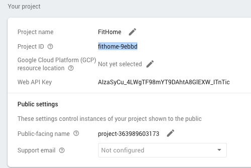

# Energy Monitor Firmware
The purpose of this project is to build the micropython code used by the energy monitor to:  
* Join the homeowner's wifi.  
* Send readings to the Firebase RT db.
# Join the Homeowner's Wifi
Soon after the electrician installs the energy monitor, the home owner must tell the energy monitor the home wifi SSID and password. The technique to do this is starting the energy monitor's firmware as a Local Access Point.  The homeowner goes to their mac or pc and scrolls the available wifi networks.  Once the energy monitor is plugged in, the network __fithome_abc__ will be added. 
The home owner:    
* goes to their mac or pc.  
* opens the drop down list of wifi networks and chooses __fithome_abc__.
* uses __fithome_abc__ for the password.
* opens a browser and types in the address ```192.168.4.1```
* A web page is shown where the user picks their wifi SSID and enters the password.  
  
After successful completion, the energy monitor is able to use the home's wifi.
  
__NOTE: The energy monitor will not be able to proceed unless there is a constant connection.__  
# Sending Readings to Firebase RT db
Before sending readings, [send_reading.py](workspace/send_reading/send_reading.py) needs configuration info stored in the config.dat file.
## Config File
The config file, [config.dat](workspace/config/config.dat), contains:  
* The __machine name__ of the energy monitor.  The machine name is made up of a common name and the date the machine was assigned to a FitHome member.  The machine name used for testing has the common name of 'bambi' and date of '07052019' = ```bambi-07052019```.  
* The __Firebase RT Project ID__ found in the firebase console for the FitHome project:  

## Rest API
The energy monitor uses the Firebase REST APIs to send readings to the Firebase RT db.  An example curl command:  
```
curl -X POST -d '{"P":1127.9}' \
  'https://<Firebase project name>.firebaseio.com/<machine name>/.json' 
```
### Curl to HTTP Post
The firmware uses HTTP.  I found this great web page that [converts curl commands to Python  ](https://curl.trillworks.com/).  VERY HELPFUL.
### Example post
For example, this code would send the power value to the Firebaase RT db that is attached to the iot-test-1e426 project:  
```
    def send_reading(self, v1, v2, i1, i2, power):
        do_connect(self.ssid, self.password)
        # .sv timestamp: http://bit.ly/2MO0XNt
        #data = '{'+'"P":{},".sv":"timestamp"'.format(power) +'}'
        data = '{'+'"P":{}'.format(power) +',"timestamp": {".sv":"timestamp"}}'
        path = 'https://iot-test-1e426.firebaseio.com/'+self.device_name+'/'+self.userID+'/.json'
        print(path)
        response = requests.post(path, data=data)
        print('response: {}'.format(response.text))
```
The power reading is sent.  The "timestamp" is generated on the Firebase server then filled into the db entry.
