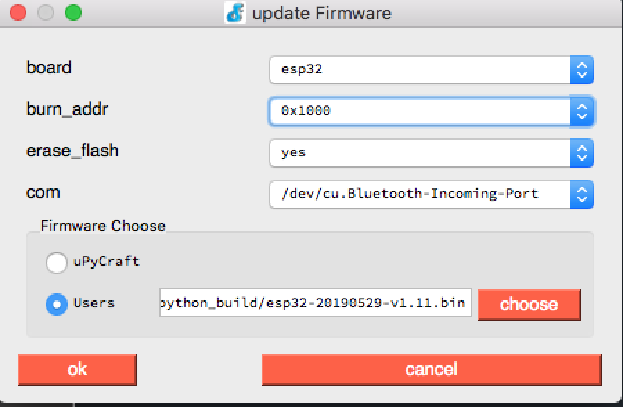

# Energy Monitor Firmware
The purpose of this project is to build the micropython code used by the energy monitor to:  
* Join the homeowner's wifi.  
* Send readings to the Firebase RT db.

To complete the steps, [clone the energy monitor GitHub repository](https://github.com/BitKnitting/energy_monitor_firmware)

# Preparing the ESP32
At least for testing, we are using [the ESP32 DevKit C](https://amzn.to/2JInYgj).  For the IDE we are using [uPyCraft](http://docs.dfrobot.com/upycraft/).   
## Install micropython
- Plug the microprocessor into the Mac's USB port.
- Open uPyCraft on the Mac.
- Check Tools/Build from the menu and make sure ESP32 is checked.
- Check Tools/Serial from the menu and select the SLAB_USBtoUART serial port.  When this is done, the >>> repl command prompt should be seen in the lower window.  
- Go to Tools/BurnFirmware.    [This is the micropython build we currently use.](micropython_build/esp32-20190529-v1.11.bin).  This version of micropython is available within [the energy monitor firmware's GitHub repository](https://github.com/BitKnitting/energy_monitor_firmware/tree/master/micropython_build).  For ESP32 micropython firmware, the settings should be:  
  
Once the fields are filled in, click on OK.  This starts the erase and burn process.   
- uPyCraft disconnects.  Once the microprocessor restarts, go ack to Tools/Select and choose the SLAB_USBtoUSART serial port. 
## Install Libraries
The libraries used by main.py include:  
* [atm90e32_registers.py](workspace/read_monitor/atm90e32_registers.py)  
* [atm90e32_u.py](workspace/read_monitor/atm90e32_u.py)  
* [config.py](workspace/config/config.py)
* [wifi_connect.py](workspace/join_wifi/wifi_connect.py)
* [send_reading.py](workspace/send_reading/send_reading.py)  
We did not compress these.  However, we have included a version of [mpy-cross](utils/mpy-cross).  
### Copy to microcontroller
To copy the files to the microcontroller using uPyCraft, we must first configure where our workspace is located. 
- Choose Tools/InitConfig  You'll be asked if you want to init. Choose yes.  
- Click on the workspace folder.  This brings up a Finder dialog box.  Choose the energy_monitor_firmware directory that is a directory within the energy_monitor_firmware project. - Click on the device folder.  Create a lib folder within the device directory.  Then copy the above files into the lib folder.
- Copy to the device/lib folder:
  - atm90e32_registers.py and atm90e32_u.py from workSpace/read_monitor.
  - config.py from workSpace/config.
  - wifi_connect.py from workSpace/join_wifi.
  - send_reading from workSpace/send_reading.
_Note: If the file is not found in the workspace, try  File/Reflush Directory)_.

## Install the Main program  
- Copy WorkSpace/main.py to the device folder.  

## config.json
A file that must exist in the lib folder but is not included in GitHub is the ```config.json``` file.  

```config.json``` contains:  
* The __mamonitorchine name__ of the energy monitor.  The monitor name is made up of a common name and the date the monitor was assigned to a FitHome member.  The monitor name used for testing has the common name of 'bambi' and date of '07052019' = ```bambi-07052019```.  
* The __Firebase RT Project ID__ found in the firebase console for the FitHome project:  
  
  
For example, 
```
{
    "monitor":"bambi-07052019",
    "project_id":"my-firebase-projectid-00989"
}  
```
This config.json file has the monitor as ```bambi-07052019``` and the firebase project id as ```my-firebase-projectid-00989```.  

# Join the Homeowner's Wifi
Soon after the electrician installs and activates the energy monitor, the home owner must tell the energy monitor the home wifi SSID and password. The technique to do this is starting the energy monitor's firmware as a Local Access Point.  The homeowner goes to their mac or pc and scrolls the available wifi networks.  Once the energy monitor is plugged in, the network __fithome_abc__ will be added. 
The home owner:    
* goes to their mac or pc.  
* opens the drop down list of wifi networks and chooses __fithome_abc__.
* uses __fithome_abc__ for the password.
* opens a browser and types in the address ```192.168.4.1```
* A web page is shown where the user picks their wifi SSID and enters the password.  
## micropython code
The code file for connecting to the wifi is [wifi_connect.py](workspace/join_wifi/wifi_connect.py).
  
After successful completion, the energy monitor is able to use the home's wifi.
  
__NOTE: The energy monitor will not be able to proceed unless there is a constant connection.__  
# Sending Readings to Firebase RT db
Before sending readings, [send_reading.py](workspace/send_reading/send_reading.py) needs configuration info stored in the config.dat file.
## Config File

## Rest API
The energy monitor uses the Firebase REST APIs to send readings to the Firebase RT db.  An example curl command:  
```
curl -X POST -d '{"P":1127.9}' \
  'https://<Firebase project name>.firebaseio.com/<monitor name>/.json' 
```
### Curl to HTTP Post
The firmware uses HTTP.  I found this great web page that [converts curl commands to Python  ](https://curl.trillworks.com/).  VERY HELPFUL.
### Example post
For example, this code would send the power value to the Firebaase RT db that is attached to the iot-test-1e426 project:  
```
    def send_reading(self, v1, v2, i1, i2, power):
        do_connect(self.ssid, self.password)
        # .sv timestamp: http://bit.ly/2MO0XNt
        #data = '{'+'"P":{},".sv":"timestamp"'.format(power) +'}'
        data = '{'+'"P":{}'.format(power) +',"timestamp": {".sv":"timestamp"}}'
        path = 'https://iot-test-1e426.firebaseio.com/'+self.device_name+'/'+self.userID+'/.json'
        print(path)
        response = requests.post(path, data=data)
        print('response: {}'.format(response.text))
```
The power reading is sent.  The "timestamp" is generated on the Firebase server then filled into the db entry.
# Reading Power Values from the Energy Monitor
We are using the [Split Single Phase Energy Meter](https://circuitsetup.us/index.php/product/split-single-phase-real-time-whole-house-energy-meter-v1-2/) to get a home's power values.  
  
## Thanks to Those That Went Before

There is _so much_ prior work that made it easier to write a CP library for the atm90e32.  Efforts include:   
* Circuit Setup's [Split Single Phase Energy Meter](https://circuitsetup.us/index.php/product/split-single-phase-real-time-whole-house-energy-meter-v1-2/).  I am delighted that John is providing us with this open source energy monitor!  It makes it easy to figure out how much electricity is being used.  Thank you John.  Thank you for helping me get started with your product.
* Tisham Dhar's [atm90e26 Arduino library](https://github.com/whatnick/ATM90E26_Arduino).   Tisham deserves a HUGE THANK YOU for his open source atm90e* hw and sw design. Tisham's excellent work and friendly help are inspirational.
* The [atm90e26 Circuit Python library I wrote](https://github.com/BitKnitting/HappyDay_ATM90e26_CircuitPython)  
* Circuit Setup's [atm90e32 Arduino library](https://github.com/CircuitSetup/Split-Single-Phase-Energy-Meter/tree/master/Software/libraries/ATM90E32)

## ESP32 DevKitC
Here is an image of the pinout:  
    
This image is better than most because it points out what GPIO pins to stay away from when setting up a GPIO pin for output, as we do for the LEDs.

### Wiring SPI
With this board I wired HSPI. [From the micropython forum](https://forum.micropython.org/viewtopic.php?t=3386), Native SPI pins are (clk, mosi, miso, cs):   
SPI1: 6, 8, 7, 11  
HSPI: 14,13,12,15  
VSPI: 18,23,19, 5  
If using native pins, the maximum SPI clock can be set to 80 MHZ.
#### HSPI  
Looking at [the micropython esp32 docs for SPI](https://docs.micropython.org/en/latest/esp32/quickref.html#hardware-spi-bus), we'll use HW SPI (id=1):  
* GPIO 14 - SCK  
* GPIO 13 - MOSI  
* GPIO 12 - MISO (HSPI Q)

The image notes that GPIO 15 is HW CS.  
For HSPI:  
```
from monitor import Pin, SPI 
hspi = SPI(1, 200000, sck=Pin(14), mosi=Pin(13), miso=Pin(12))  
```
#### VSPI
Some boards - such as the esp32 wemos  
    

This board has grouped pins to make it "easier" to wire for VSPI: 
VSPI: 18,23,19, 5
* GPIO 18 - SCK  
* GPIO 19 - MISO 
* GPIO 23 - MOSI  
* GPIO 5  - CS

For VSPI:  
```
vspi = SPI(2, baudrate=200000, polarity=0, phase=0, bits=8, firstbit=0, sck=Pin(18), mosi=Pin(23), miso=Pin(19))
```
### Wiring LEDs
We decided on two LEDs, a red one for errors, and a green one to let us know the monitor is working.  According to the pinout above, the pins to stay away from are:  
*  GPIO6-11  
*  We need output pins, so don't use GPIO36,39,34,35 because they are input only.